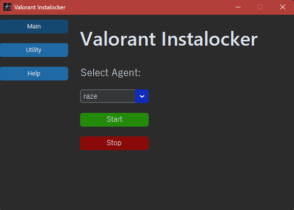
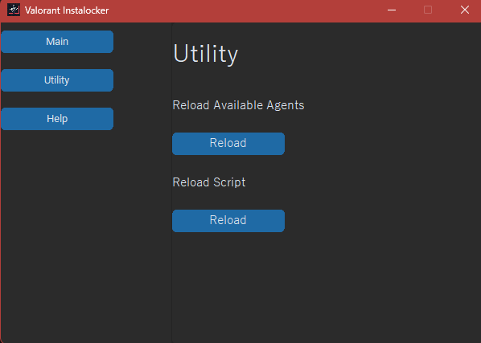
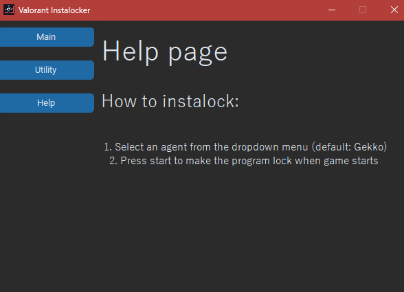

# OUTDATED: DM @borghettoo ON DISCORD TO PURCHASE NEW VERSION

#🎮 Valorant Instalocker - ValoLocker

ValoLocker is a Python-based tool designed to help you lock your desired Valorant agent before anyone else! 🚀  
With a clean and intuitive GUI, ValoLocker handles any potential errors and logs actions directly in the terminal.  

---

## 🔥 Features

- **Fast Instalocking**: THe instalocing process is really fast and done by using API calls and not Image manipulation;
- **Helpful Features**: When a new agent is added you can go in the *'utility'* page and reload all the agent UUIDS, so the newer agents will be added tot he list:
- **Clean GUI**: The GUI (Graphical User Interface) was made to be clean so that everything can be found quickly and won't burn your eys with a light theme 😉;

---

## 🖼️ Screenshots

Utility View:  

Help Window:  

---

## ⚙️ Usage

1. Download the latest release [here](https://github.com/borgox/ValoLocker/releases/tag/v1.0.1).
2. Run the `exe` file.
3. Pick your desired agent from the list.
4. Press the green **Start** button.
5. Start the queue in Valorant.
6. Enjoy! 🎉

---

## 🛠️ Utilities

- **Reload Script:** You can reload the script directly from the GUI without restarting the program.

---

## ⚠️ Disclaimer

I am **NOT** responsible for any actions taken with this tool. Use it at your own risk (though the risk is minimal, XD).

---

### 🌟 Support

Feel free to open issues on the [GitHub repository](https://github.com/borgox/ValoLocker/issues).
